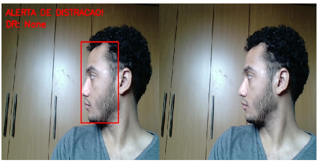

# EyeTractor

## Sistema dedicado à detecção de fadiga e distração de motoristas, utilizando técnicas de gaze tracking baseadas em redes neurais.


Tabela de conteúdos
=================
<!--ts-->
   * [Sobre](#Sobre)
   * [Tabela de Conteudo](#tabela-de-conteudo)
   * [Instalação](#instalacao)
   * [Pre Requisitos](#pre-requisitos)
   * [Tecnologias](#tecnologias)
<!--te-->

### Features

- [x] Localização de rosto na imagem
- [x] Detecção de fadiga
- [x] Detecção de distração
- [x] Acionamento de uma saída digital da Raspberry Pi 4 para ativar o alarme sonoro e luminoso
- [x] Envio de dados para monitoramento por dashboard em nuvem
- [x] Visualização, por celular, da imagem que está sendo processada pelo sistema embarcado



### Pré-requisitos

Antes de começar, você vai precisar ter instalado ** Python 3.7.3** com os seguintes módulos:

- OpenCV 4.4.0
- Dlib 19.21.0
- Numpy 1.19.2
- Imutils 0.5.3
- Azure 0.11.1

### Executando o software

```bash
# Clone este repositório
$ git clone https://github.com/brunoachaves/EyeTractor.git

# Acesse a pasta do projeto no terminal/cmd
$ cd EyeTractor

# Para executar
$ python3 eye_tractor.py
```

### Tecnologias

As seguintes ferramentas foram usadas na construção do projeto:

- Haar Cascades
- Deep Neural Networks
- Facial Landmarks
- Azure IoT Hub
- Flask app


### Autores
- Bruno de Araujo Chaves
- Diogo Marinho de Araujo
- Isabelle Puertas Ruiz
- Matheus Oliveira de Araujo
- Gabriel Lara Baptista

